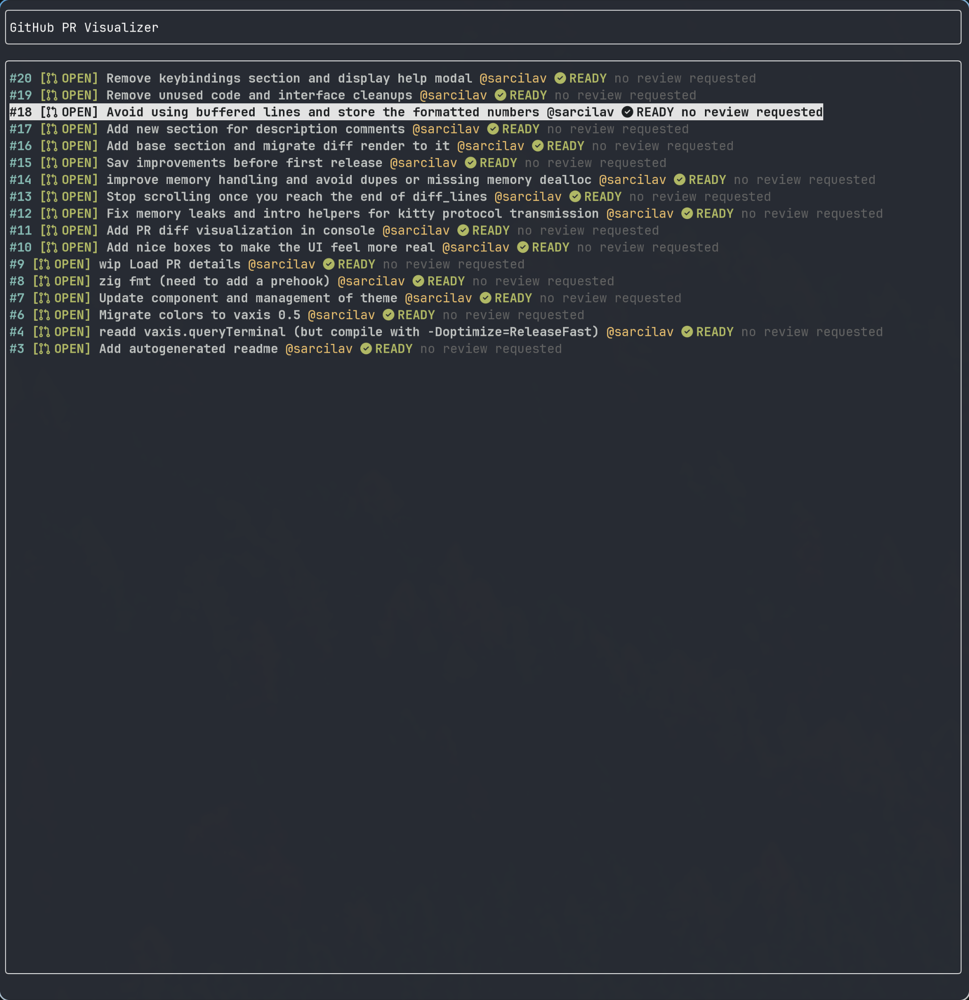
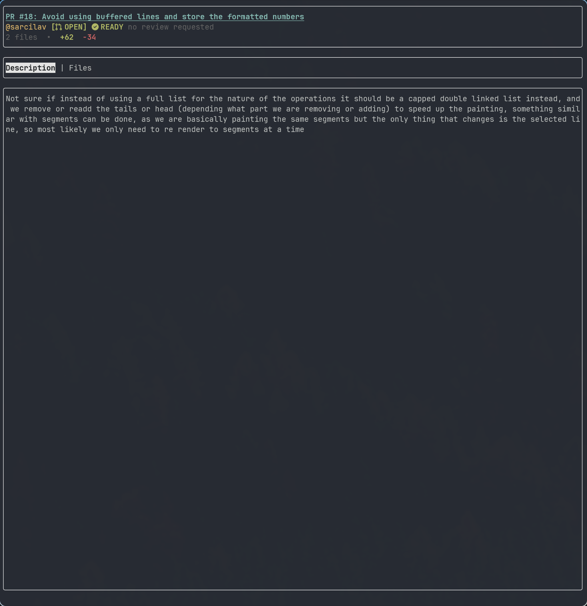
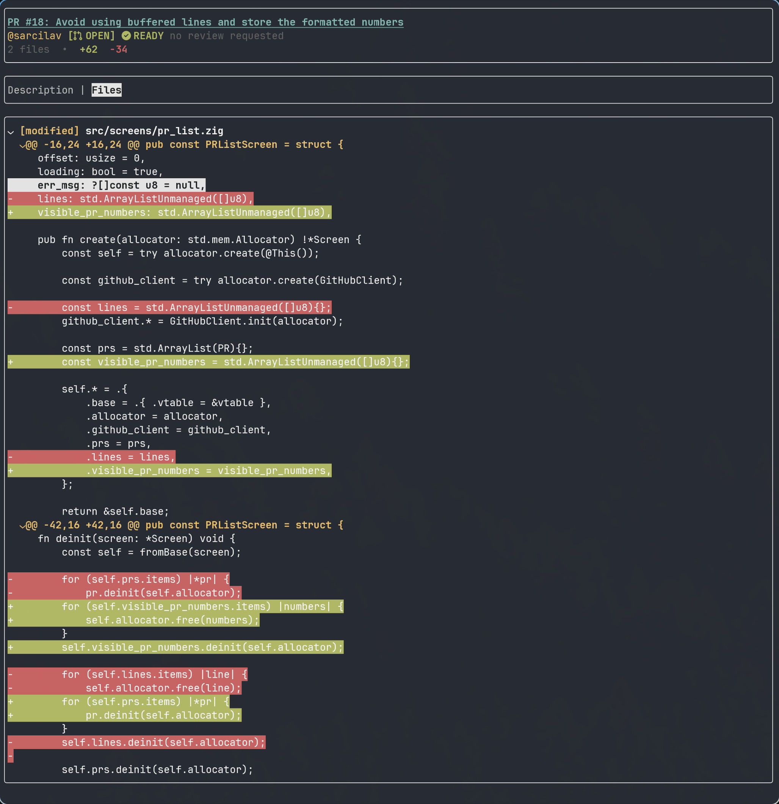
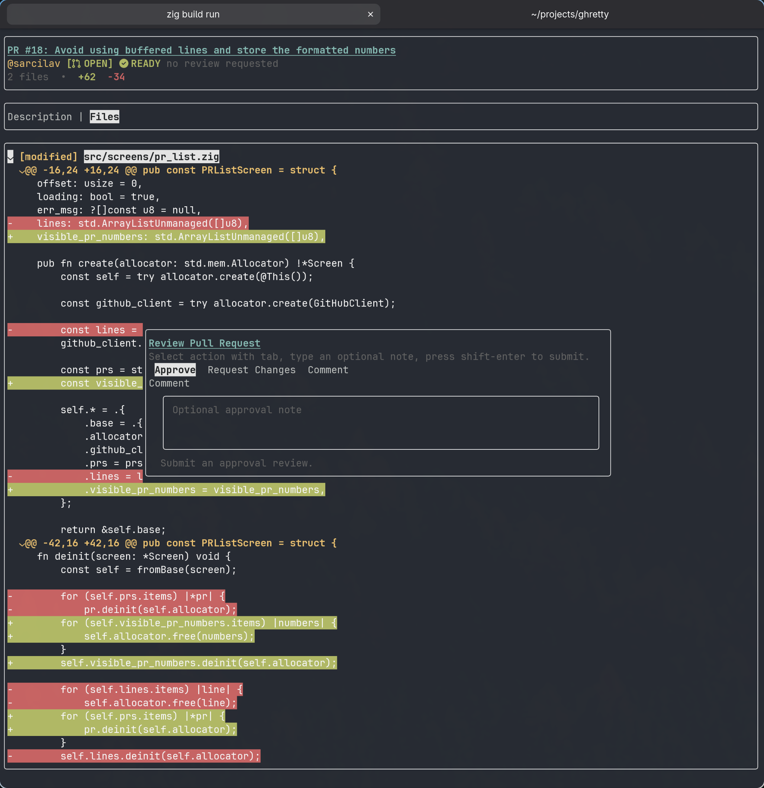
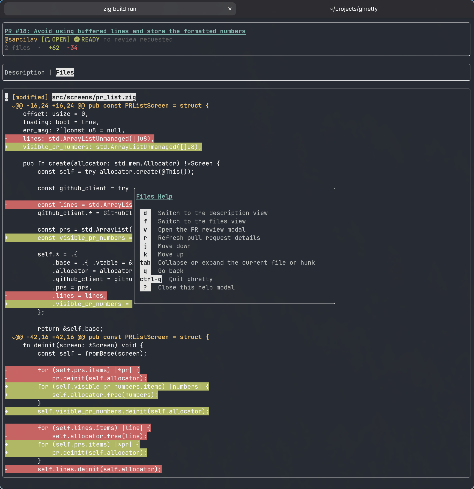

# ghretty

`ghretty` is a small terminal UI for GitHub pull requests built with Zig, Vaxis, and the GitHub CLI.

It started as a toy project and it still is one on purpose. The goal is to learn, dogfood basic PR workflows from the terminal, and enjoy building small things like code visualization and TUI interactions.

It is already useful enough to play around with: browse pull requests, open details, inspect diffs, submit reviews, and merge or close PRs. It is also still early, still changing, and not trying to replace more complete tools like `gh-dash`.

## What It Does

- List pull requests for the current repository
- Open a pull request details view
- Switch between description and files
- Inspect file diffs from the terminal
- Approve, comment, or request changes
- Merge with merge commit, squash, or rebase
- Close a pull request with an optional comment
- Show contextual help inside the app

## Screenshots

### Pull request list



### Pull request details



### Diff view



### Review and merge actions





## Requirements

- Zig `0.15.2`
- [`gh`](https://cli.github.com/) installed and authenticated
- A terminal with UTF-8 support

`ghretty` shells out to `gh`, so your GitHub auth, repo access, and permissions come from your existing GitHub CLI setup.

## Run It

Clone the repo and build it:

```bash
git clone git@github.com:sarcilav/ghretty.git
cd ghretty
zig build
```

Run it inside a Git repository that `gh` can understand:

```bash
zig build run
```
## Current State

This project is intentionally small and still rough around the edges.

Right now it is good enough for basic PR workflows and for learning while building:

- Browsing pull requests.
- Reading descriptions.
- Visualizing diffs.
- Approving or commenting on reviews.
- Merging or closing pull requests.

Things I may explore later:

- Checkout flows.
- Sending edits back as patches into multiline comments.
- Tree-sitter experiments for code exploration or syntax highlighting.
- Testing.

## Why This Exists

Part of the point of `ghretty` is to stay in the slower part of building software.

It is a side project for learning Zig, learning TUI quirks, dogfooding a small tool on real pull requests, and keeping the craft fun. Some of the early attempts included trying to vibe code parts of the app, and that mostly reminded me that I still enjoy understanding the path more than just racing to the result.

## Development

The project is built with:

- [Zig](https://ziglang.org/)
- [Vaxis](https://github.com/rockorager/libvaxis)

Needs a working and authenticated [GitHub CLI](https://cli.github.com/)

Main areas in the codebase:

- `src/github/` GitHub CLI integration.
- `src/screens/` list and details screens.
- `src/tui/` layout, sections, diff rendering, help and action modals.
- `src/models/` pull request and git diff models.

## License

[MIT](LICENSE)
